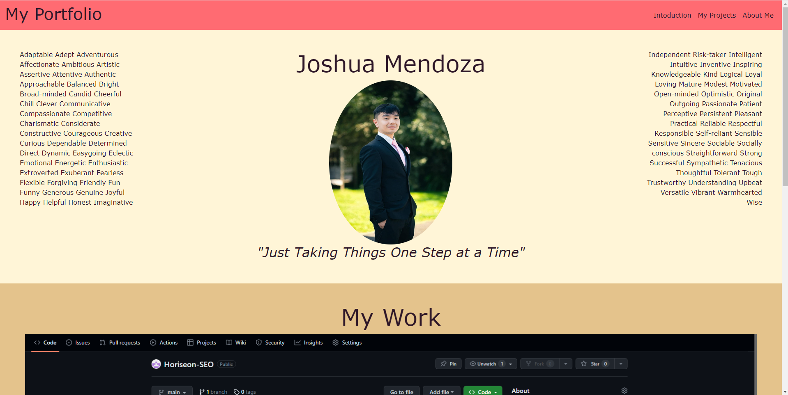
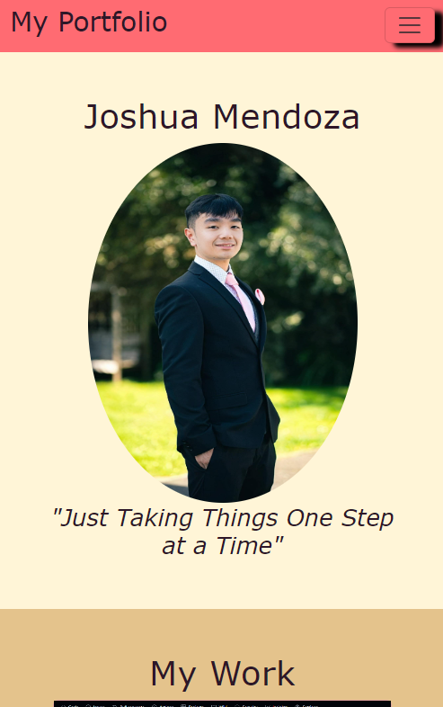
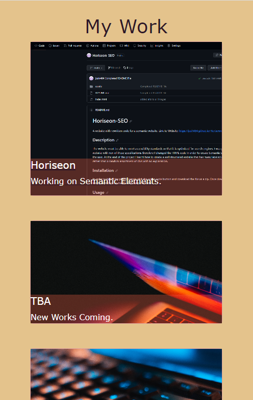

# Bootstrap-Portfolio
My portfolio but powered by bootstrap
 
Link to Webpage: https://josh484.github.io/Bootstrap-Portfolio/
## Description 
The website is a portfolio of the work I have done, it is a work in progress and will be updated with more of my work once I do them. The website contains all that I have learnt by week 3 of the bootcamp. It highlights not only my skills on HTML and CSS but also my understanding of bootstrap and customisation of it. The website also contains Semantic Tags and uses minimal media queries only using one as bootstrap is a mobile first framework so it has good scalability

At the end of this project I am more confident in my use of bootstrap. 
## Installation
In order to install the project simply click the green code button and download the file as a zip. 
Once downloaded simply right click on the file and unzip the folder.
## Usage 
Once the file is downloaded you can open the index.html on your web browser you will be met with this page:
.
For Those who are using a phone you may be met with this page instead:
.
 

The buttons at the right serve as the guide for sections of the page (Top Right for Computer users). 
Each Image link/will link to a project that I have done for now it is only the first one that will do so.

## Features
Here are a list of features for my website.

- Navigation buttons at the top will link you to sections of the page
- On mobile the nav buttons can be accessed via the button on the right as a drop down.
- On large screens you will see my picture and name in the middle with some writings on the side. However on mobile the side descriptions are intentionaly left out through the use of bootstrap
- The my Work section uses modified bootstrap cards which hold the texts inside. On large screens the first card is larger than the rest to highlight it as the main project.
- My Work cards uses m-0 and p-0 are used to make sure background for text reaches 100% width. Flex on bootstrap is also used to keep text at the bottom.
- On small screens my Work section becomes a single column for easier scrolling. 

 
- About me section contains a list with all the skills that I have and will learn throughout the bootcamp with checks and crosses.
- Contact me section which the last 3 are meant to link to their respective website when clicked, first 2 are popovers which show my email and phone as shown below:
 

